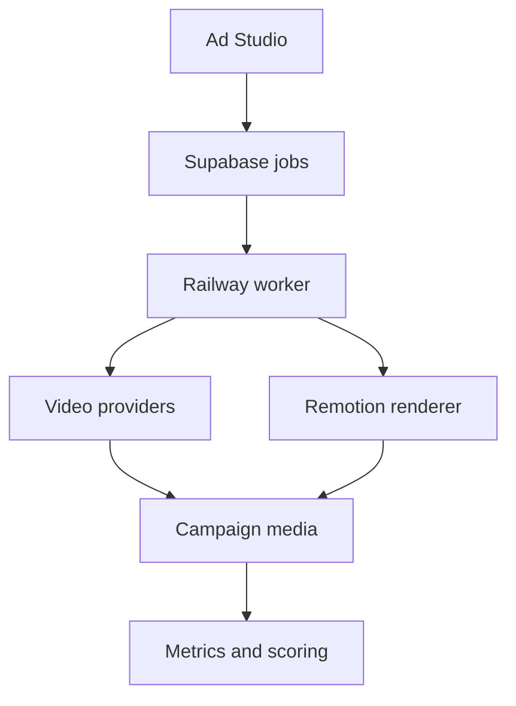

# Wilson Creative Studio

Wilson Creative Studio is a private, multi-provider production system for creating
YouTube and social-media ads. It combines an authenticated generation workbench,
campaign planning, brand kits, shot generation, candidate review, Remotion
rendering, cost controls, and creative-performance scoring.

The repository retains the historical `open-higgsfield` slug for compatibility.
The product is not affiliated with or endorsed by Higgsfield. “Wilson Creative
Studio” is a working product name; obtain trademark clearance before a public
commercial launch.

## What is implemented

- A 38-model image/video catalog and normalized provider interface.
- An Ad Studio at `/ads` with Fullcourt, Pocket, and PWS brand templates.
- Supabase authentication, owner-scoped campaigns, shots, generation jobs,
  provider accounts, media, renders, metrics, quotas, and audit events.
- Server-side encrypted provider credentials. Provider keys are never stored in
  cookies or returned to the browser.
- Runway and fal.ai shot generation through a shared provider registry, candidate
  selection, cancellation, campaign budgets, and approval gates.
- A Railway worker for polling, retries, cancellation, expired-upload cleanup,
  and Remotion MP4 rendering.
- Campaign-linked media history, CSV analytics import, and creative scoring.
- Account rate limits and daily upload, generation, render, and cost quotas.



## Local development

Requirements: Node.js 22+, pnpm 12, a Supabase project, and a Railway-compatible
PostgreSQL/Supabase deployment.

```bash
pnpm install --frozen-lockfile
pnpm dev
```

Copy `.env.example` to `.env.local` and configure:

- `NEXT_PUBLIC_SUPABASE_URL`
- `NEXT_PUBLIC_SUPABASE_PUBLISHABLE_KEY`
- `SUPABASE_SECRET_KEY` (worker only)
- `PROVIDER_ENCRYPTION_KEY` (32 random bytes encoded as hex)
- `APP_URL`
- `HF_API_BASE_URL` for the legacy provider adapter, if used

Apply all migrations in `supabase/migrations` before starting the web and worker
services. Railway runs the web service from `Dockerfile` and the background worker
from `Dockerfile.worker`.

## Verification

```bash
pnpm test
pnpm typecheck
pnpm build
pnpm test:smoke
pnpm test:e2e
```

Production browser tests require `E2E_BASE_URL`, `E2E_USER_EMAIL`, and
`E2E_USER_PASSWORD`. Paid generation is opt-in through
`E2E_RUN_PAID_GENERATION=1`.

Runway and fal.ai keys are entered in the authenticated Ad Studio provider
panel. They are encrypted server-side; they are not Railway environment
variables and are never returned to the browser. Model labels distinguish
executable integrations from catalog-only entries.

See [Ad Studio setup](docs/AD_STUDIO_SETUP.md) for deployment configuration and
[the build plan](docs/AD_STUDIO_PLAN.md) for implemented and remaining work.

## License

This is proprietary software. No right to use, copy, modify, or distribute it is
granted except by a separate written agreement. See [LICENSE](LICENSE).
