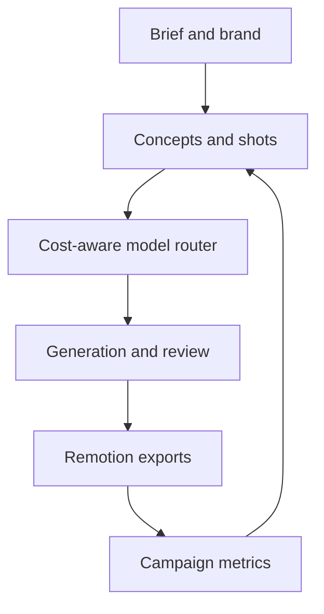

# Ad Studio build plan

Status date: 2026-09-18

## Product direction

Wilson Creative Studio is an ad-production layer over multiple image and video
engines. Its proprietary value is the ad director, brand memory, model routing,
review workflow, reusable rendering templates, and performance feedback loop.
Training a base video model is not part of the current roadmap.

## Current implementation

### Foundation and Ad Studio — complete

- Authenticated, owner-scoped Supabase workspaces, brands, campaigns, briefs,
  concepts, variants, and editable shots.
- Channel presets for YouTube Shorts/in-stream, Instagram Reels, TikTok, and
  Facebook Feed.
- Fullcourt, Pocket, and PWS brand templates.
- Encrypted server-side provider accounts; no provider keys in cookies.
- Account-scoped uploads, 100 MB per-file validation, lifecycle records, and
  automatic expiry cleanup.
- Campaign save, duplicate, approve, archive, and optimistic revision checks.

### Generation and media — complete for Runway and initial fal.ai models

- Persistent shot and generation-job records.
- Shared production-provider registry with Runway and fal.ai adapters, normalized
  status/error handling, retries, polling, idempotency, stored upstream
  cancellation URLs, and user-requested cancellation.
- Truthful model states distinguish live/connected integrations from catalog-only
  entries. Initial fal.ai routes cover Kling, MiniMax Hailuo, and Wan video.
- Generate-shot controls in Ad Studio, candidate selection, and campaign-linked
  media history.
- Campaign cost estimates, reservations, actual cost capture, budget ceilings,
  approval gates, account rate limits, and daily usage quotas.
- Append-only audit events for paid job creation, state changes, cancellation,
  campaign approvals, budget changes, and expired media cleanup.
- Model ranking incorporates capability fit, expected price, provider health,
  historical quality, and availability when those signals are supplied.

### Rendering — usable first release

- Persistent render jobs and a Railway worker.
- Remotion composition and MP4 rendering for selected campaign media.
- Brand colors, text overlays, aspect-ratio presets, and saved render output.

### Analytics — usable first release

- Campaign metrics CSV import.
- Creative scoring from impressions, views, clicks, conversions, spend, and
  revenue, linked back to campaign media.

## Remaining roadmap

### Multi-provider depth

- Add Veo and other direct adapters after confirming API access, commercial terms, model
  licenses, output rights, and cancellation semantics.
- Add provider webhooks, a live health collector, and automatically refreshed
  price and capability catalogs.
- Add reference-image continuity and inexpensive contact sheets before full video
  spending.

### Editing and sound

- Visual timeline trim/reorder controls and render version history.
- Voice generation or uploaded voiceover, licensed music/SFX metadata, automatic
  captions, loudness normalization, and safe-zone validation.
- Smart crop and simultaneous 9:16, 16:9, 4:5, and 1:1 exports.

### Learning loop

- Automated hook, CTA, offer, duration, and opening-frame variants.
- Platform publishing adapters and scheduled analytics ingestion.
- Explainable next-test recommendations and a trained private creative ranker
  once enough clean outcome data exists.
- Quality classifiers for broken text, product shape, continuity, and unsafe or
  noncompliant claims.

## Production acceptance criteria

- A user can plan, save, approve, generate, cancel, review, render, and score an
  ad without losing work after a reload.
- Every paid attempt is owner-scoped, budget-checked, quota-checked, and audited.
- Expired public uploads are removed by the worker and recorded in the audit log.
- Production browser tests verify authenticated upload and explicitly opt-in paid
  generation against the deployed Railway application.

## Naming and licensing

The repository's historical `open-higgsfield` slug is retained to avoid breaking
deployment links. The public working name is Wilson Creative Studio, with no
claimed affiliation with Higgsfield. Formal trademark clearance is required
before public commercial launch. The repository is proprietary under `LICENSE`.
