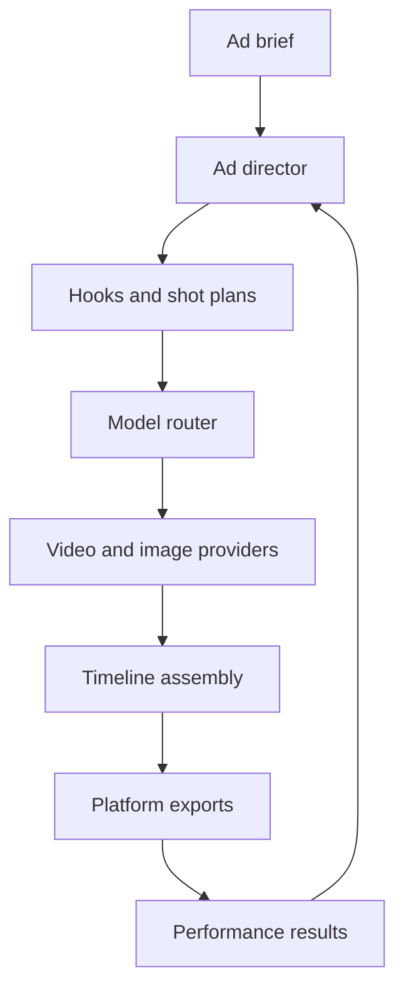

# Ad Studio Build Plan

## Recommendation

Keep the current studio as the generation workbench and build an ad-production layer above it.

Do not train a base text-to-video model first. That would require a large licensed video dataset, a GPU training operation, safety work, and continuing model research. The first proprietary model should be an **ad director** that turns a business brief into hooks, scripts, shots, prompts, platform variants, and model-routing decisions. Existing video engines should render the shots.

The product becomes defensible through:

1. Brand memory and reusable product assets.
2. A structured ad brief and storyboard system.
3. Automatic selection of the right generation model for each shot.
4. Assembly into finished ads with captions, voiceover, music, logos, and end cards.
5. Performance data that teaches a private hook and creative-ranking model what converts.

## Repository audit

The current repository is a capable single-user generation console:

- Next.js 16, React 19, Zustand, Railway, and Supabase Storage.
- 38 image and video entries in a catalog.
- One normalized request shape: model, prompt, media, and settings.
- One upstream generation API selected through `HF_API_BASE_URL`.
- Browser-local history in IndexedDB.
- No database-backed projects, users, campaign records, storyboard, timeline, rendering pipeline, team roles, cost controls, or performance analytics.

Issues to correct before public multi-user use:

- The API key is stored as plain JSON in an httpOnly cookie. Move provider secrets to server-side encrypted storage.
- Upload authorization is account-scoped through Supabase Storage policies.
- Generation request and response bodies are written to server logs.
- There is no ownership check for uploads, projects, or generations.
- The repository describes itself as open source but contains no license file. Choose a license before accepting outside contributions or commercial forks.
- The current name is close to Higgsfield's trademark. Use a distinct product name before launch.

## Product workflow



### 1. Brief

Collect the brand, product, target audience, customer problem, promise, offer, proof, CTA, channels, tone, mandatory copy, prohibited claims, product images, logo, and reference ads.

### 2. Ad director

Generate three to ten creative angles per brief. Each output must be structured data, not a block of prose:

- Hook and first-frame direction.
- Beat-by-beat script.
- Shot duration.
- Visual prompt.
- Voiceover.
- On-screen text.
- Product/reference asset requirements.
- Disclosure and claim checks.
- Target placement and safe zones.

Use a general language model with schema-constrained output in the first release. Save every human edit so the system can later be fine-tuned on accepted ad plans.

### 3. Model router

Select a video engine per shot based on:

- Text-to-video, image-to-video, reference-to-video, or motion control.
- Aspect ratio and duration.
- Product and character consistency.
- Native audio requirements.
- Turnaround time.
- Expected cost.
- Provider health and rate limits.
- Historical acceptance rate for that shot type.

The application owns the normalized request and job records. Each provider adapter translates those records to its own API and maps its status back to the shared job state.

### 4. Assembly

Generation APIs should create source shots. A render worker should produce the final ad:

- Trim and reorder shots.
- Voiceover and music mix.
- Burned-in captions.
- Product lockup, logo, offer, CTA, and legal copy.
- Brand fonts and colors.
- Smart crop for 9:16, 16:9, 4:5, and 1:1.
- MP4 export with platform presets.
- Thumbnail and poster frame.

Use a server-side render worker with FFmpeg. Remotion is a good option for reusable React-based ad templates, while FFmpeg should handle encoding and media normalization.

### 5. Learning loop

Store creative variables beside results from the ad platforms:

- Hook angle.
- Opening frame.
- Script and CTA.
- Shot model/provider.
- Duration and placement.
- Spend, impressions, thumb-stop rate, three-second views, completion rate, CTR, CPA, and ROAS.

Start with a simple weighted ranking model. Train a private ranking model only after there is enough clean outcome data. The ranking target should reflect the campaign goal, not raw views.

## Data model

Use a relational database with row-level ownership:

- `workspaces`
- `memberships`
- `brands`
- `brand_assets`
- `campaigns`
- `ad_briefs`
- `creative_concepts`
- `ad_variants`
- `shots`
- `generation_jobs`
- `provider_accounts`
- `render_jobs`
- `exports`
- `creative_metrics`
- `audit_events`

Store media in object storage. Store only object IDs and metadata in the database. Provider secrets belong in encrypted server-side storage and must never be returned to the browser.

## Provider architecture

Every adapter implements the same contract:

- `submit({ model, plane })`
- `status(requestId)`
- Declared capabilities.
- Provider-specific credentials.
- Error normalization.
- Idempotency key support.
- Webhook verification when supported.
- Cost and usage capture.

The current upstream platform is now wrapped behind that contract. The next adapter can be added without changing the composer or ad planner. Select direct providers only after confirming current API access, commercial terms, model licenses, rate limits, and output-use rights.

## Delivery phases

### Phase 0: Foundation — started in this branch

- Added channel-specific output presets for YouTube Shorts, YouTube in-stream, Instagram Reels, TikTok, and Facebook Feed.
- Added a typed ad brief, shot, target, and variant model.
- Added deterministic generation of three hook angles per channel.
- Added shot-level model ranking from the existing catalog.
- Added `POST /api/ad-plan`.
- Added a generation-provider contract.
- Wrapped the current API as the first provider with no behavior change.

### Phase 1: Projects and Ad Studio UI

Build a new Ad Studio route alongside the existing generation studio.

- Authentication and workspace ownership.
- Brand kit.
- Campaign and brief wizard.
- Reference ad uploads.
- Concept board with hook variants.
- Storyboard editor.
- Save, duplicate, approve, and archive.
- Persistent database records.
- Server-side provider credentials.
- Upload authentication and quotas.

Acceptance: a user can create a campaign, save a brand, produce three editable storyboards, close the browser, and return without losing work.

### Phase 2: Multi-provider generation

- Provider registry and per-model provider mapping.
- Queue-backed generation jobs.
- Webhook and polling support.
- Retry, cancel, timeout, and idempotency.
- Cost estimate before generation.
- Budget ceilings per campaign and workspace.
- Reference-image continuity across shots.
- Contact sheet generation before spending on full video renders.

Acceptance: one storyboard can send different shots to different providers and recover from one provider failing without losing the campaign.

### Phase 3: Finished-ad rendering

- Timeline and trim controls.
- Voice generation or uploaded voiceover.
- Music and sound-effect library with license metadata.
- Caption generation and editing.
- Logo, offer, CTA, disclaimer, and end-card templates.
- FFmpeg/Remotion render worker.
- Export presets and safe-zone validation.
- Versioned final renders.

Acceptance: the user can export a finished 9:16 and 16:9 ad from one storyboard, with readable captions and correct branding.

### Phase 4: Variant factory and analytics

- Generate hook, CTA, offer, duration, and opening-frame variants.
- Naming and UTM conventions.
- Optional publishing adapters.
- Import placement-level results.
- Creative scorecards.
- Recommendation engine for the next batch.
- Human approval before publishing or increasing spend.

Acceptance: the system can connect an exported variant to outcome data and explain which creative variables should be tested next.

### Phase 5: Proprietary models

Build models in this order:

1. Prompt and script refiner trained on approved human edits.
2. Creative ranker trained on campaign outcomes.
3. Brand-style image adapters or LoRAs for brands with enough licensed assets.
4. Shot-quality classifier that rejects broken hands, logos, text, continuity, or product shape before assembly.

Do not train a base video model unless the company later has a licensed dataset, a dedicated ML team, and enough volume to justify the GPU cost.

## API shape added in Phase 0

`POST /api/ad-plan`

Example request:

```json
{
  "brandName": "Fullcourt",
  "productName": "Fullcourt",
  "audience": "pickup basketball organizers",
  "problem": "games are scattered across group texts and email threads",
  "promise": "organize the entire run in one place",
  "offer": "Create your first public game free",
  "proof": ["Players can join, check in, and follow game updates from one app"],
  "callToAction": "Create your game on Fullcourt",
  "goal": "install",
  "channels": ["youtube_shorts", "instagram_reels", "tiktok"],
  "tone": ["funny", "competitive", "fast"]
}
```

The response contains platform-specific variants, timed beats, safe zones, and the top compatible models for every shot.

## First production milestone

The best first release is a narrow **Ad Director MVP**:

- One brand kit.
- One brief form.
- Three hook concepts.
- One editable storyboard.
- Generation through the current provider plus one second provider.
- Automatic captions and end card.
- 9:16 and 16:9 export.
- Project persistence.
- Cost shown before generation.

That is enough to produce real Fullcourt, PocketOS, and PWS ads, collect edits, and learn which parts of the workflow deserve automation next.
